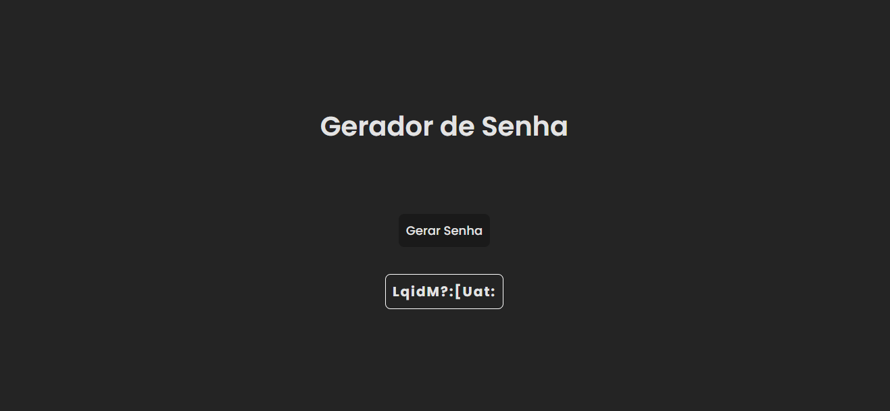

# Password Generator

 <!-- Se você tiver uma imagem de banner, inclua aqui -->

## Descrição

Este é um aplicativo de gerador de senha (Password Generator) simples, criado com React e Vite, e estilizado com CSS. Ele permite a geração de senhas fortes.

## Tecnologias Utilizadas

- [React](https://reactjs.org/)
- [Vite](https://vitejs.dev/)
- CSS

## Instalação e Uso

Siga estas etapas para rodar o projeto na sua máquina local:

### Pré-requisitos

Certifique-se de ter o [Node.js](https://nodejs.org/) instalado na sua máquina.

### Passo a Passo

1. **Clone este repositório:**

    ```bash
    git clone https://github.com/beater27032001/Todo-List.git
    cd nome-do-repositorio
    ```

2. **Instale as dependências:**

    ```bash
    npm install
    ```

3. **Rode o aplicativo:**

    ```bash
    npm run dev
    ```

4. **Abra o navegador:**

    Abra o navegador e acesse `http://localhost:3000`.

## Acesse o Site

Você também pode acessar o aplicativo online através do link abaixo:

[To-Do List - Versão Online](https://todo-list-iota-ebon.vercel.app)
